# Panduan penggunaan Aplikasi

#### 1. Pastikan Anda sudah memiliki server Jena Fuseki pada PC/Laptop Anda. Jika belum, Anda dapat men*download* server Jena Fuseki pada link berikut :

#### https://jena.apache.org/download/

#### 2. Nyalakan server Jena Fuseki dengan memasukkan *command* berikut pada Terminal maupun Command Prompt dan pastikan posisi direktori Anda sedang berada di dalam folder apache jena yang sudah di *download* tadi
`java -jar fuseki-server.jar --update`

#### 3. Kemudian buka browser Anda dan masukkan URL http://localhost:3030 untuk mengecek apakah server sudah menyala atau belum

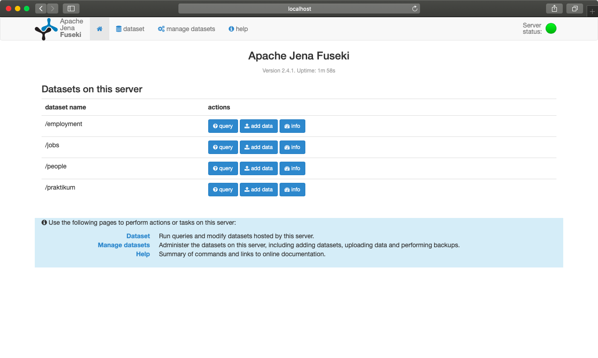
(Tampilan jika server berhasil jalan)

#### 4. Setelah menambah dataset yang dibutuhkan pada server Jena Fuseki, tambahkan/ganti pilihan dari scroll box yang terdapat pada aplikasi. Penggantian atau penambahan dapat dilakukan pada *file* MainController.java

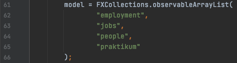
(Code terdapat pada function initialize pada MainController.java)

#### 5. Setelah mengubah daftar dataset sesuai dengan yang terdapat pada server Jena Fuseki, Anda dapat menjalankan Aplikasi menggunakan IntelliJ ataupun IDE lainnya.

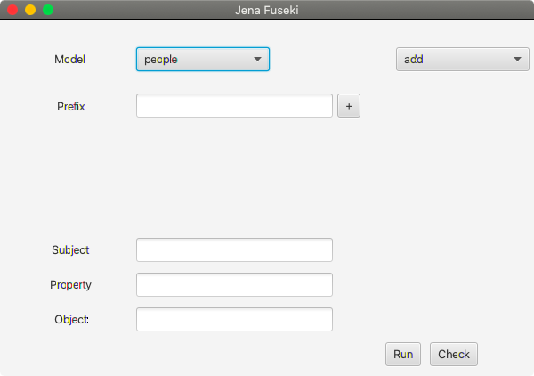
(Tampilan Aplikasi setelah dijalankan)

### Penjelasan Isi Aplikasi
* Model : Berisi dataset yang sudah diatur pada MainController.java dimana data di dalam model inilah yang akan 
  digunakan untuk melakukan SPARQL Update (Insert dan Delete).

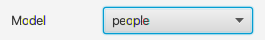

* Prefix : Prefix merupakan field untuk mengisi prefix yang digunakan pada saat melakukan SPARQL Update. Prefix 
  dapat ditambah hingga 5 prefix dengan menekan tombol +.
  
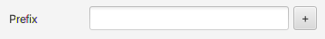
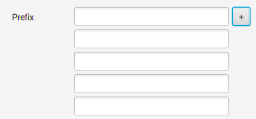

* Scroll Box SPARQL Update : Berisi jenis SPARQL Update yang dapat dilakukan diantaranya add, delete data, dan 
  delete where.
  
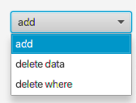

* Subject, Property, Object : Merupakan field yang tersedia untuk mengisi bagian subject, property, dan object yang 
  ingin dipakai pada saat melakukan SPARQL Update.
  
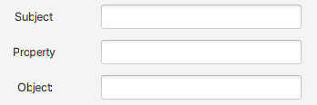

* Run and Check : Tombol Run digunakan untuk menjalankan SPARQL Update, Sedangkan tombol Check untuk mengecek isi 
  dari dataset yang dipilih.
  
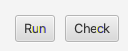

### Contoh Penggunaan Aplikasi

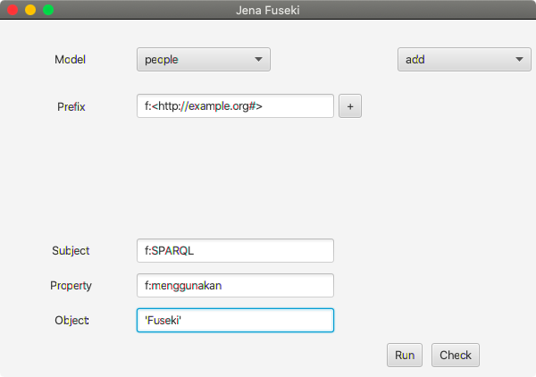
(Add data)

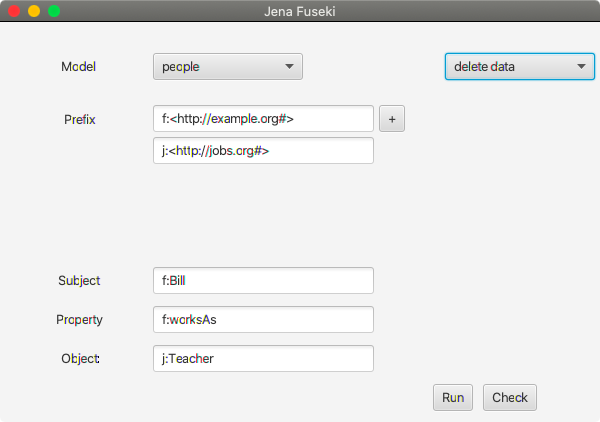
(Delete Data)

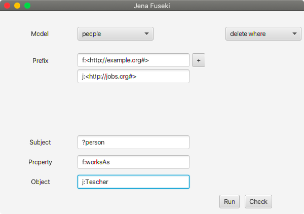
(Delete Where)